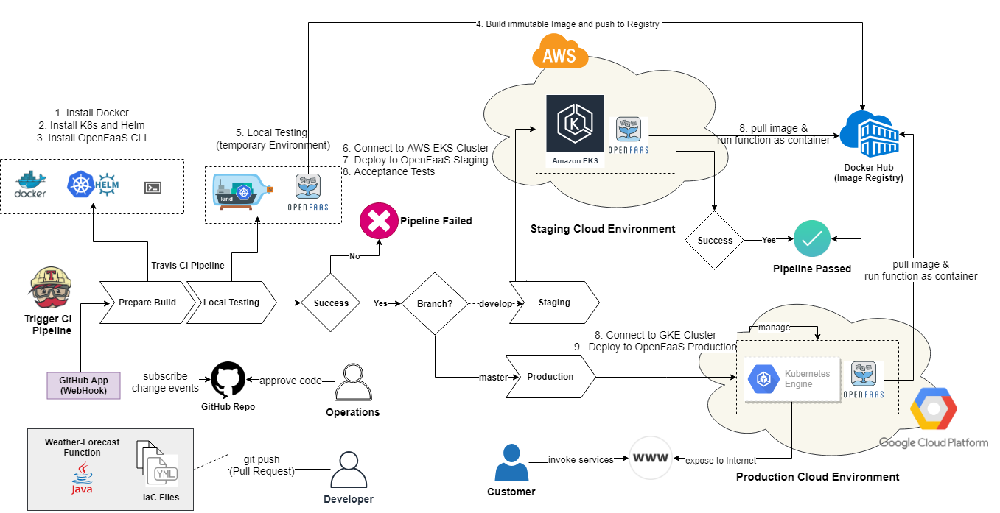
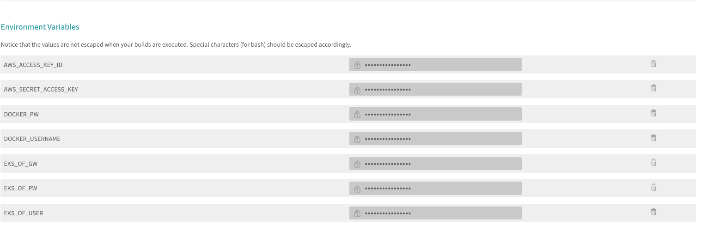

# Cloud Agnostic Continuous Delivery For Serverless Applications
This repository should give concepts of developing unified (vendor/cloud-agnostic) CI/CD pipelines with DevOps principles for serverless applications. This 
pipeline uses 3 OpenFaaS instances on three Kubernetes Cluster with On-Prem (VM of Travis-CI), AWS and GCP. So you have a multi-cloud deployment pipeline which is cloud-agnostic and you can run everywhere.

1. KinD (Kubernetes in Docker) cluster as Temporarily environment for testing
2. AWS EKS Cluster as STAGING environment 
3. Google Kubernetes Engine (GKE) Cluster as PRODUCTION environment

## CI/CD Pipeline with Travis CI



## Prerequisites


You can just setup your AWS and Google Cloud credentials on your computer and run the installation scripts from this repo to setup the environments

* AWS Account for creating EKS Cluster (Free Tier is sufficient)
* [AWS credentials configured](https://docs.aws.amazon.com/de_de/sdk-for-java/v1/developer-guide/setup-credentials.html) setting up on local computer
* Create a Google Cloud Account for creating GKE Cluster
* [Google Cloud SDK installation](https://cloud.google.com/sdk/)

## OpenFaaS Installation on AWS

The installation of a Kubernetes Cluster on the Cloud takes about 10-15 minutes. The OpenFaaS installation takes only about 2 minutes.

With this command you get a working OpenFaaS instance on your AWS EKS Cluster as **Staging** Environment:

``` 
./scripts/installation/openfaas-eks-cluster.sh
```
This script will install [eksctl](https://eksctl.io/) tool from Weaveworks for easier creation of a cluster, create the cluster with the name `openfaas-eks-staging` on AWS and install OpenFaaS on the cluster with [Helm](https://helm.sh/), the Kubernetes package manager.

You can change your User and Password in the script as you like. Later you can use them as encrypted Environment Variables on Travis CI for your pipeline.

With this command you get a working OpenFaaS instance on your GKE Cluster as **Production** Environment:

```
./scripts/installation/openfaas-gke-cluster.sh
```
**This is WIP (not ready yet)**
<!-- - Terraform - IaC Tooling
- kubectl - The Kubernetes CLI
- Helm - The package manager for K8S
- OpenFaaS CLI - Create, Build & Deploy FaaS-Apps in a Cluster at a Cloud Provider of your choice. -->

## Install OpenFaaS CLI
This CLI is used to build and deploy our declarative configured functions (YAML).
```
curl -sSL https://cli.openfaas.com | sudo sh
```

# Pipeline Usage Tutorial

To get the pipeline running you need to do these steps:

1. Fork this GitHub Repo to your projects
2. Go to https://travis-ci.com/ and link your forked repo with Travis CI.
3. Put your Kubernetes Config file to root of your repo:(it is needed to connect to your cluster)
   ```
   cp ~/.kube/eksctl/clusters/openfaas-eks-staging.yml .
   ```
4. Create the following Environment Variables
   1. `AWS_ACCESS_KEY_ID` - your AWS Access Key
   2. `AWS_SECRET_ACCESS_KEY` - Your AWS Secret Access Key
   3. `DOCKER_USERNAME` - Your Docker Username
   4. `DOCKER_PW` - Your Docker Password
   5. `EKS_OF_URL` - the URL which is resulted from the staging environment script
   6. `EKS_OF_USER` - Username for OpenFaaS you used in the staging environment script
   7. `EKS_OF_PW` - Password for OpenFaaS you used in the staging environment script

   
5. checkout the develop branch and update it to the current branch
6. Trigger your Travis CI Pipeline

That's it !
 
